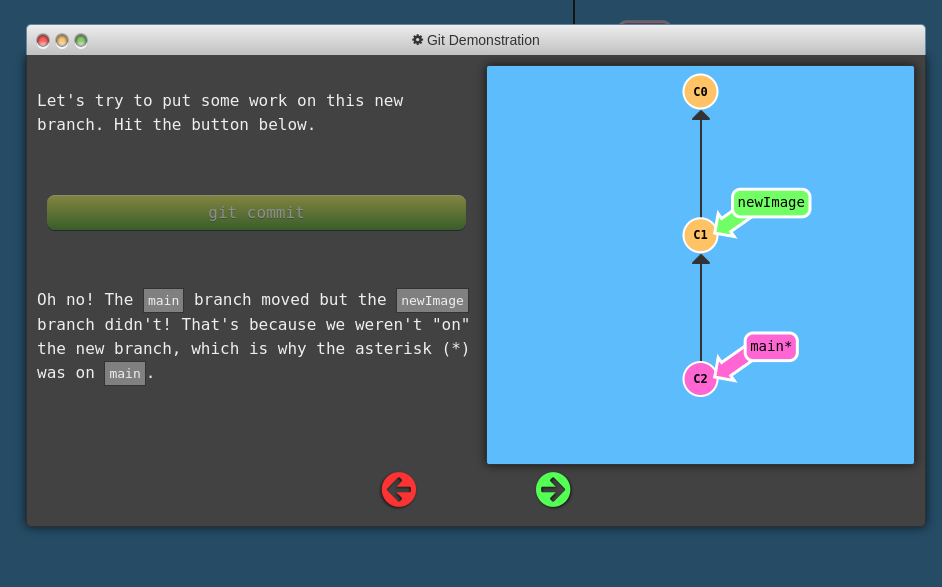

<h2> difference between catkin_make and catkin_build </h2>
  
 catkin build can be used from any directory in the workspace while catkin_make only works in the top level directory. 

<h2> what is echo for?</h2>
  
 It shows the data published on a topic 

<h2> what is a package , and what does it contain? </h2>
  
 1)it must contain a <strong>.xml file </strong>

  
 2)it must contain a CMakeLists.txt which uses catkin </strong>

<a href="https://ongkitwei.github.io/passenger-counter/"> click here </a>

<h2> GIT </h2>

<ul>
  <h3>What is git? </h3>
  <li>keep track of changes to code, synchronise work/code with different colleagues</li>
  <li>test changes to code without losing the original</li>
  <li>revert back to old version of code!</li>
  
  <h3> Git Clone:</h3>
  <li> take a repository from internet and download it onto your computer (nned the github repo link)</li>
  
  <h3> Git Commit:</h3>
  <li> save the current state of the files and folders inside the repository and take a snapshot, so that later you can refer back to them</li>
  <li>can use git commit -m "write the meesage u want to convey"</li>
  
  <li> if u wanna combine git commit and git add, eg: wanna git add all the files, u can use <strong>git commit -am "message u wanna write here"</strong>
  
  <h3> Git Add:</h3>
  <li> it is use to add a file into a checklist such tht when the next time u wanna save it, git will save all these files you have added. it is kinda      like shortlisting the files you wanna save!</li>
  
   <h3> GIT status:</h3>
  <li> It tells u what is currently happening in ur github repo</li>
  
  
  
  <h3> GIT push</h3>
  <li> take your changes you have made in repo and push it up to github (same concept as git clone just opp) </li>
  <li> need to generate token if not get this error</li>
  
</ul>
